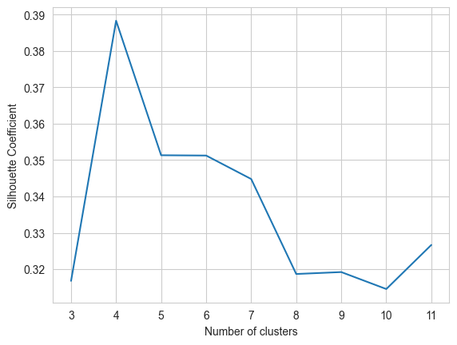
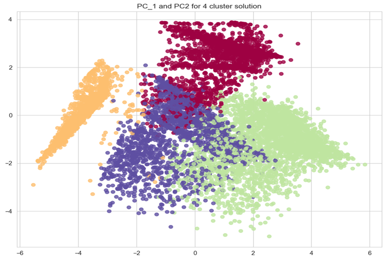

# <u> Credit Card Customer Segmentation</u>

--------------------------------------------------------------------------------

  

**Business Context:** This project aims to develop a customer segmentation to define marketing strategy. The dataset has about 9000 credit card holders information for last 6 months.

## Project Summary
* Derived new KPI by using data manipulation methods.
* Checked the multi-collinearity using heatmap.
* Standardized the data and applyied PCA to get optimal number of Pricipal Components.
* KMeans Clustering is used - Silhotte Score and Cluster Inertia Score used to fix the number of clusters.
* Done profiling to draw insights for the clusters.

## Final Clusters and Recommendations 
* Based on silhouette_score, i have taken number of clusters to be 4.

* **Suggested Marketing Strategy for these clusters:**

  * Group 0 
   - They are potential target customers who are paying bills and doing purchases and maintaining comparatively good credit score. So we can <i>increase credit limit or can lower down interest rate. Promote premium cards/loyality cards</i> to increase transcations.
   
* Group 1
   - These customers are taking maximum cash advance, these customers should be given remainders for payments. Offers can be provided on early payments to improve their payment rate.

  * Group 2
   - This is performing best among all the clusters are maintaining highest monthly average purchases. Giving any reward points might increase their purchases.
   
 * Group 3
   - This group is doing maximum oneoff payments(may be for bills only). Customers of this group can be offered discount/offer on next transactions upon full payment.
   
